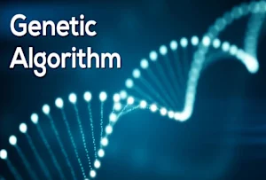
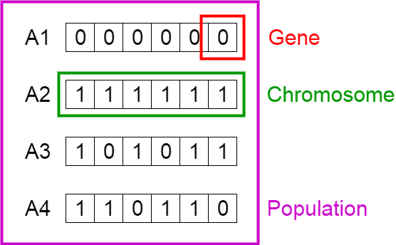
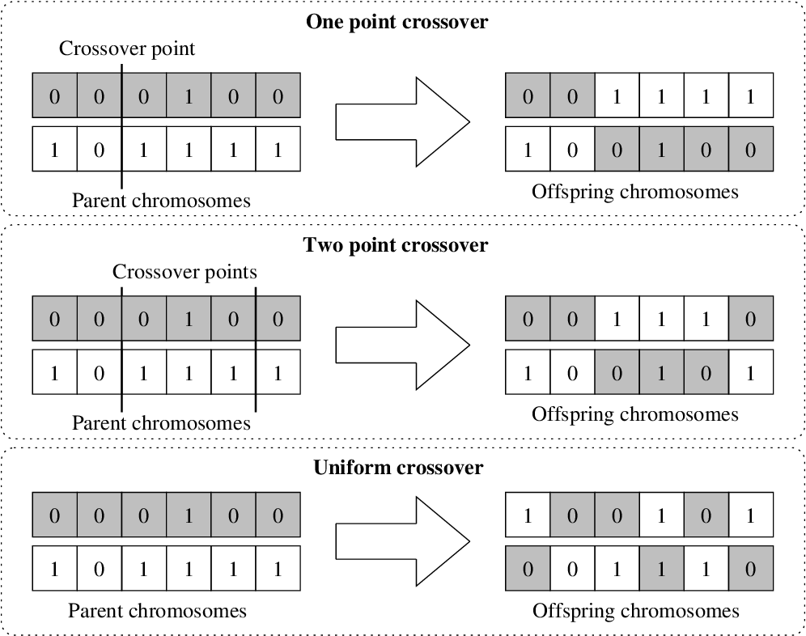
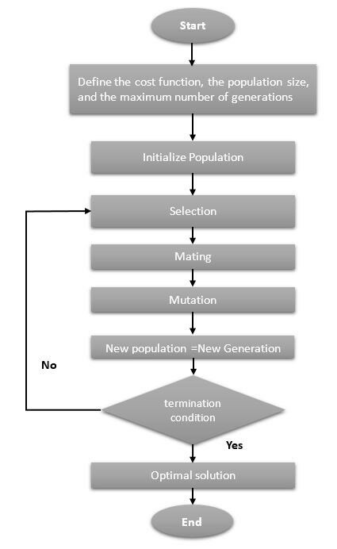
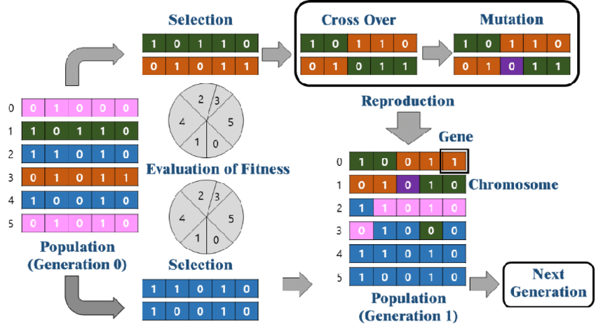

# Genetic Algorithms (GA)



## Overview

Genetic Algorithms (GA) are a powerful class of optimization algorithms inspired by the principles of natural selection and genetics. Developed by John Holland in the 1960s and 1970s, GAs are used to solve complex optimization problems by evolving solutions over successive generations. This evolutionary approach simulates the process of natural evolution, where the fittest individuals are selected to reproduce and pass on their traits to the next generation.

## Key Concepts

1. **Biological Inspiration:**
   - **Natural Evolution:** GAs mimic the process of natural evolution, where the fittest individuals are more likely to survive and reproduce. This process leads to the gradual improvement of the population over generations.
   - **Chromosomes:** In GAs, potential solutions are represented as chromosomes (strings of genes), analogous to biological chromosomes. Each gene represents a decision variable or part of the solution.



2. **Population:**
   - **Initial Population:** A GA starts with a randomly generated population of potential solutions. The size of the population can affect the algorithm's performance and convergence rate.
   - **Fitness Function:** Each individual (chromosome) in the population is evaluated using a fitness function, which measures how well it solves the optimization problem. The fitness function guides the selection process.

3. **Selection:**
   - **Fittest Individuals:** Selection is the process of choosing the fittest individuals from the population to reproduce. Several selection methods can be used, such as roulette wheel selection, tournament selection, and rank-based selection.
   - **Reproduction:** Selected individuals reproduce to create offspring for the next generation. The aim is to pass on desirable traits and improve the overall fitness of the population.

4. **Crossover (Recombination):**
   - **Genetic Operator:** Crossover is a genetic operator that combines parts of two parent chromosomes to produce offspring. This process introduces new combinations of genes, promoting diversity in the population.
   - **Types of Crossover:** Common crossover methods include single-point crossover, multi-point crossover, and uniform crossover. The crossover rate determines the frequency of crossover operations.

5. **Mutation:**
   - **Genetic Diversity:** Mutation introduces random changes to individual genes in a chromosome, maintaining genetic diversity and preventing premature convergence to local optima.
   - **Mutation Rate:** The mutation rate determines the probability of mutation occurring in a chromosome. A low mutation rate is typically used to balance exploration and exploitation.

## Process of Genetic Algorithms (GA)

1. **Initialization:**
   - **Population Generation:** Create an initial population of potential solutions (chromosomes), typically generated randomly.
   - **Parameter Setting:** Set algorithm parameters such as population size, crossover rate, mutation rate, and the number of generations.

2. **Evaluation:**
   - **Fitness Calculation:** Evaluate the fitness of each individual in the population using a predefined fitness function that measures how well it solves the optimization problem.

3. **Selection:**
   - **Parent Selection:** Select individuals from the current population based on their fitness to act as parents. Common selection methods include roulette wheel selection, tournament selection, and rank-based selection.

4. **Crossover (Recombination):**
   - **Offspring Generation:** Apply crossover operators to pairs of selected parents to create offspring. This introduces genetic diversity by combining parts of two parent chromosomes.
   - **Crossover Methods:** Common methods include single-point crossover, multi-point crossover, and uniform crossover.

   

5. **Mutation:**
   - **Genetic Variation:** Apply mutation operators to offspring with a certain probability to introduce random changes. This helps maintain genetic diversity and prevents premature convergence.

6. **Replacement:**
   - **New Population:** Replace some or all of the current population with the new offspring to form the next generation.

7. **Termination Check:**
   - **Stopping Criteria:** Check if the termination criteria are met (e.g., a maximum number of generations, a satisfactory fitness level, or convergence of the population). If met, stop the algorithm; otherwise, return to the evaluation step.





## Pseudocode for Genetic Algorithms (GA)

```plaintext
Initialize population P with random individuals
Set algorithm parameters (population size, crossover rate, mutation rate, etc.)

While termination criterion not met:
    Evaluate fitness of each individual in P
    
    Select parents from P based on fitness
    
    Apply crossover to selected parents to create offspring
    
    Apply mutation to offspring
    
    Replace population P with offspring (and possibly some elite individuals from P)
    
    Optionally apply local search to improve offspring
    
End While

Return the best solution found
```

## Advantages of Genetic Algorithms (GA)

1. **Robustness:**
   - **Versatility:** GAs can be applied to a wide range of optimization problems, including those that are nonlinear, multi-modal, and discrete.
   - **Global Search Capability:** GAs are less likely to get trapped in local optima compared to traditional optimization methods, as they maintain a population of solutions that explore the search space.

2. **Flexibility:**
   - **Problem Independence:** GAs do not require gradient information or other problem-specific knowledge, making them applicable to problems where such information is unavailable or unreliable.
   - **Multi-Objective Optimization:** GAs can handle multiple conflicting objectives simultaneously, providing a set of Pareto-optimal solutions.

3. **Adaptability:**
   - **Dynamic Environments:** GAs can adapt to changing environments, making them suitable for real-time and dynamic optimization problems.
   - **Hybridization:** GAs can be easily combined with other optimization techniques (e.g., local search methods) to enhance performance.

4. **Parallelism:**
   - **Inherent Parallelism:** The population-based approach of GAs allows for parallel processing, which can significantly speed up the search process on modern multi-core processors or distributed computing systems.

## Disadvantages of Genetic Algorithms (GA)

1. **Computational Cost:**
   - **Resource Intensity:** GAs can be computationally expensive, especially for large populations and complex problems, due to the need for evaluating multiple solutions over many generations.
   - **Slow Convergence:** GAs may require a large number of generations to converge to an optimal or near-optimal solution, leading to longer computation times.

2. **Parameter Sensitivity:**
   - **Tuning Required:** The performance of GAs depends on the careful tuning of parameters such as population size, crossover rate, and mutation rate. Improper parameter settings can lead to poor performance or premature convergence.

3. **No Guarantee of Optimality:**
   - **Suboptimal Solutions:** GAs do not guarantee finding the global optimal solution. They often provide good approximations, but there is no certainty that the best solution has been found.

4. **Complexity of Implementation:**
   - **Algorithm Design:** Designing a GA requires careful consideration of encoding schemes, selection mechanisms, and genetic operators. This complexity can be challenging for new practitioners.

## Applications

1. **Engineering Design:**
   - **Optimization:** GAs are used to optimize design parameters for maximum efficiency and performance in various engineering fields, including mechanical, civil, and aerospace engineering.
   - **Robust Solutions:** GAs can handle complex, nonlinear, and multi-objective optimization problems, providing robust solutions for engineering design challenges.

2. **Machine Learning:**
   - **Feature Selection:** GAs are employed for feature selection, identifying the most relevant features that contribute to model performance.
   - **Hyperparameter Tuning:** GAs optimize hyperparameters of machine learning models, improving their accuracy and generalization ability.

3. **Scheduling:**
   - **Resource Allocation:** GAs efficiently allocate resources and tasks in complex scheduling problems, such as job shop scheduling, project scheduling, and timetabling.
   - **Dynamic Adaptation:** GAs can adapt to changing constraints and requirements, making them suitable for dynamic scheduling environments.

4. **Financial Modeling:**
   - **Trading Strategies:** GAs optimize trading strategies by evolving rules and parameters to maximize returns and minimize risks in financial markets.
   - **Portfolio Optimization:** GAs help in optimizing investment portfolios, balancing risk and return to achieve the best financial performance.

5. **Bioinformatics:**
   - **Genetic Data Analysis:** GAs analyze genetic data, solving complex biological problems such as gene sequencing, protein structure prediction, and genetic pathway analysis.
   - **Biological Insights:** GAs provide insights into biological processes by simulating evolutionary mechanisms and identifying key genetic factors.

## Conclusion

Genetic Algorithms leverage the principles of natural selection and genetics to evolve solutions for complex optimization problems. Their flexibility, adaptability, and ability to handle diverse problem domains make them a powerful tool in the optimization toolkit. By mimicking natural evolutionary processes, GAs can efficiently explore and exploit the search space, finding optimal or near-optimal solutions for a wide range of applications.
