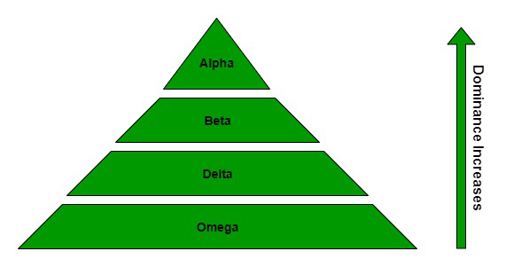
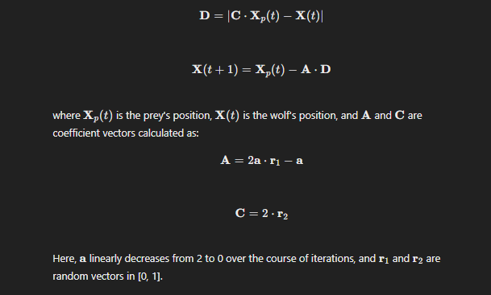
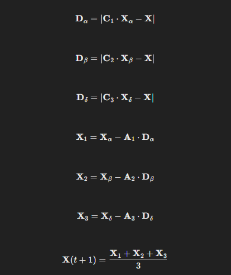

# Gray Wolf Optimization (GWO)

## Definition

Gray Wolf Optimization (GWO) is a nature-inspired optimization algorithm that mimics the social hierarchy and hunting behavior of gray wolves in nature. It was introduced by Seyedali Mirjalili, et al. in 2014. The GWO algorithm is used to solve complex optimization problems by modeling the leadership hierarchy and group hunting mechanism of gray wolves.

## Key Concepts

1. **Leadership Hierarchy**:
   - **Alpha (α)**: The leader of the pack, responsible for decision-making and leading the hunt.
   - **Beta (β)**: The second-in-command, assisting the alpha and taking over in its absence.
   - **Delta (δ)**: The third level in the hierarchy, subordinate to alpha and beta, but superior to omega.
   - **Omega (𝜔)**: The lowest ranking wolves, following the higher-ranking wolves.

   

2. **Hunting Behavior**:
   - Gray wolves encircle prey and attack cooperatively. This behavior is modeled in the algorithm to update the positions of candidate solutions.

## Mechanism of GWO

The GWO algorithm can be summarized in the following steps:

1. **Initialization**:
   - Initialize a population of gray wolves (candidate solutions) with random positions in the search space.
   - Identify the best solution as the alpha (\(\alpha\)), the second best as beta (\(\beta\)), and the third best as delta (\(\delta\)).

2. **Encircling Prey**:
   - Wolves encircle prey using the following equations:

    

3. **Hunting**:
   - The hunting process is guided by the best three solutions (𝛼, 𝛽, and 𝛿):

    

4. **Update**:
   - Evaluate the fitness of each candidate solution.
   - Update the positions of alpha, beta, and delta if better solutions are found.

5. **Termination**:
   - Repeat the process until a stopping criterion is met (e.g., a maximum number of iterations or a satisfactory fitness level).

## Pseudo-Code for GWO

```pseudo
Initialize the population of gray wolves (candidate solutions)
Initialize alpha, beta, and delta

While (t < MaxIter):
    For each wolf (candidate solution):
        Update position using alpha, beta, and delta
        Evaluate fitness of the new position
        Update alpha, beta, and delta if necessary

    Increment iteration counter t

Return the best solution (alpha)
```

## Advantages

1. **Simplicity**:
   - **Understanding**: GWO is straightforward to comprehend, relying on simple mathematical models inspired by the natural hierarchy and hunting behavior of gray wolves.
   - **Implementation**: The algorithm can be easily coded in various programming languages without requiring complex operations or deep theoretical knowledge.

2. **Few Parameters**:
   - **Ease of Tuning**: GWO has fewer parameters compared to many other optimization algorithms, making it easier to tune. The primary parameters are the population size and the maximum number of iterations.
   - **Robust Performance**: Despite having few parameters, GWO is robust and performs well across a variety of optimization problems.

3. **Exploration and Exploitation Balance**:
   - **Exploration**: GWO effectively explores the search space through mechanisms like encircling prey and utilizing a diverse set of candidate solutions (wolves).
   - **Exploitation**: The algorithm refines potential solutions by leveraging the hierarchical structure (alpha, beta, delta wolves) to guide the search towards promising areas.

## Disadvantages

1. **Premature Convergence**:
   - **Local Optima**: GWO can sometimes converge too quickly to local optima, especially in complex multimodal functions where multiple good solutions exist.
   - **Exploration Trade-Off**: While the balance between exploration and exploitation is generally good, in some cases, the algorithm may need additional mechanisms to escape local optima.

2. **Parameter Sensitivity**:
   - **Initialization**: The performance of GWO can be sensitive to the initial settings of parameters such as population size and the linear decrease of the parameter \(a\).
   - **Problem-Specific Tuning**: Different problems might require specific tuning of parameters to achieve optimal performance, which can be time-consuming and require expert knowledge.

## Applications

1. **Engineering Design**:
   - **Structural Design**: GWO optimizes the design of structures (e.g., bridges, buildings) to achieve objectives like minimizing weight while ensuring strength and stability.
   - **Mechanical Component Optimization**: Used to optimize components such as gears, bearings, and springs for improved performance and longevity.

2. **Machine Learning**:
   - **Feature Selection**: GWO helps in selecting the most relevant features from large datasets, improving the performance and interpretability of machine learning models.
   - **Hyperparameter Tuning**: GWO optimizes hyperparameters of machine learning algorithms, leading to better model accuracy and efficiency.

3. **Image Processing**:
   - **Image Segmentation**: GWO is applied to divide an image into meaningful regions, useful in medical imaging, remote sensing, and object recognition.
   - **Image Enhancement**: GWO optimizes parameters for enhancing image quality, such as adjusting brightness, contrast, and noise reduction.

4. **Power Systems**:
   - **Economic Load Dispatch**: GWO determines the optimal power output of generators to meet demand at the lowest cost.
   - **Unit Commitment**: GWO schedules the on/off states of power generation units to minimize operational costs while meeting the required load.

5. **Financial Modeling**:
   - **Portfolio Optimization**: GWO allocates assets in a portfolio to maximize returns and minimize risk, providing balanced investment strategies.
   - **Option Pricing**: GWO is used to calibrate models for accurately pricing financial derivatives like options, ensuring better financial decision-making.

6. **Telecommunications**:
   - **Network Design**: GWO optimizes the placement and configuration of network nodes, improving coverage and reducing costs.
   - **Routing Optimization**: GWO finds the most efficient paths for data transmission in communication networks, minimizing latency and maximizing throughput.

## Conclusion

Gray Wolf Optimization (GWO) leverages the natural behaviors of gray wolves to provide a powerful and flexible optimization tool. Its simplicity, effectiveness, and adaptability make it suitable for a wide range of applications, from engineering design and machine learning to image processing and financial modeling. However, like any optimization algorithm, it has its challenges, including potential premature convergence and sensitivity to parameter settings, which require careful consideration and tuning for best results. 