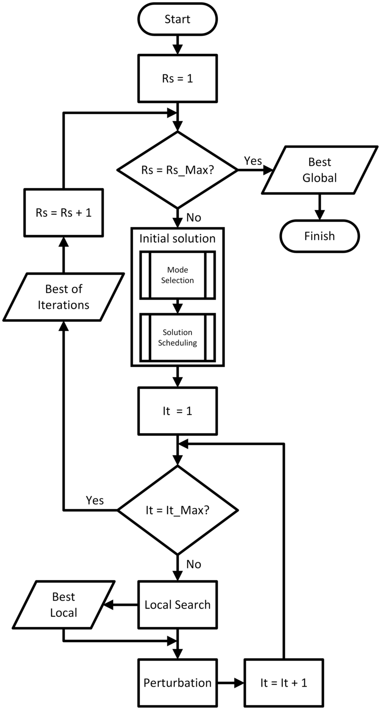

# Iterated Local Search (ILS)

## Overview

Iterated Local Search (ILS) is a metaheuristic optimization algorithm designed to find high-quality solutions by iteratively improving a candidate solution through local search and perturbation. ILS is particularly effective for combinatorial optimization problems where the search space is large and complex.

## Key Concepts

1. **Local Search**:
   - Local search is a procedure that starts with an initial solution and iteratively moves to a neighboring solution that improves the objective function. The process continues until a local optimum is reached, where no neighboring solution provides a better objective function value.

2. **Perturbation**:
   - Perturbation is a mechanism used to escape local optima by making a significant change to the current solution. This change is often random or semi-random and aims to explore new regions of the search space.

3. **Iteration**:
   - The ILS algorithm iterates between performing local search and perturbation to continually refine and improve the solution.

## Mechanism of Iterated Local Search

The ILS algorithm involves the following steps:

1. **Initialization**:
   - Generate an initial solution (S_0).
   - Apply local search to (S_0) to find a locally optimal solution (S_loc).

2. **Iteration**:
   - While the stopping condition is not met:
     - **Perturbation**: Apply a perturbation to (S_loc) to generate a new solution (S').
     - **Local Search**: Apply local search to (S') to find a new locally optimal solution (S'_loc).
     - **Acceptance Criterion**: Decide whether to accept (S'_loc) as the new current solution (S_loc). This is typically based on the quality of (S'_loc) compared to (S_loc).

3. **Termination**:
   - Repeat the iteration steps until a stopping condition is met (e.g., a maximum number of iterations, a time limit, or a satisfactory solution quality is achieved).

## Iterated Local Search FlowChart



## Pseudo-Code for Iterated Local Search

```pseudo
Generate initial solution S0
Apply local search to S0 to obtain S_loc

While (stopping condition not met):
    Apply perturbation to S_loc to obtain S'
    Apply local search to S' to obtain S'_loc
    If (acceptance criterion met):
        S_loc = S'_loc

Return the best solution found
```

## Advantages

1. **Effectiveness in Large Search Spaces**:
   - ILS is effective in large and complex search spaces because it combines the intensification capability of local search with the exploration capability of perturbation.

2. **Simplicity and Flexibility**:
   - The algorithm is simple to implement and can be easily adapted to different optimization problems by customizing the local search and perturbation methods.

3. **Escaping Local Optima**:
   - The perturbation step allows ILS to escape local optima, providing a mechanism to explore new regions of the search space and potentially find better solutions.

4. **Balance of Exploration and Exploitation**:
   - ILS balances exploration (through perturbation) and exploitation (through local search), making it robust and efficient in finding high-quality solutions.

## Disadvantages

1. **Parameter Sensitivity**:
   - The performance of ILS can be sensitive to the choice of perturbation strength and the acceptance criterion. These parameters often require careful tuning.

2. **Computational Cost**:
   - Depending on the complexity of the local search and the size of the search space, ILS can be computationally expensive, especially if many iterations are needed to find an optimal solution.

3. **Problem-Specific Customization**:
   - The effectiveness of ILS depends on the design of the local search and perturbation mechanisms, which need to be tailored to the specific problem being solved.

## Applications

1. **Combinatorial Optimization**:
   - **Traveling Salesman Problem (TSP)**: ILS can find near-optimal tours by iteratively improving a candidate tour through local search and perturbation.
   - **Knapsack Problem**: ILS optimizes the selection of items to maximize the total value without exceeding the weight limit.

2. **Scheduling**:
   - **Job Scheduling**: ILS is used to optimize the scheduling of jobs on machines to minimize total production time or maximize resource utilization.
   - **Timetabling**: ILS creates conflict-free timetables for schools or universities, improving resource allocation and minimizing scheduling conflicts.

3. **Routing**:
   - **Vehicle Routing Problem (VRP)**: ILS optimizes the routes for a fleet of vehicles to minimize travel time and costs.
   - **Network Design**: ILS improves the design of communication networks to enhance performance and reduce costs.

4. **Resource Allocation**:
   - **Portfolio Optimization**: ILS allocates assets in a financial portfolio to maximize returns and minimize risks.
   - **Project Management**: ILS optimizes the allocation of resources to tasks in a project to minimize completion time and costs.

## Conclusion

Iterated Local Search is a powerful and flexible optimization algorithm that combines the strengths of local search and perturbation to find high-quality solutions to complex optimization problems. Its simplicity, robustness, and effectiveness in large search spaces make it a valuable tool for a wide range of applications. However, careful tuning of parameters and problem-specific customization of local search and perturbation mechanisms are essential for achieving optimal performance.