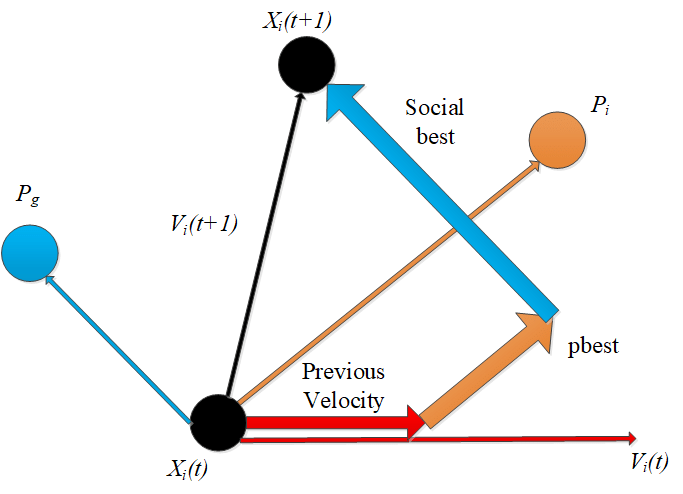
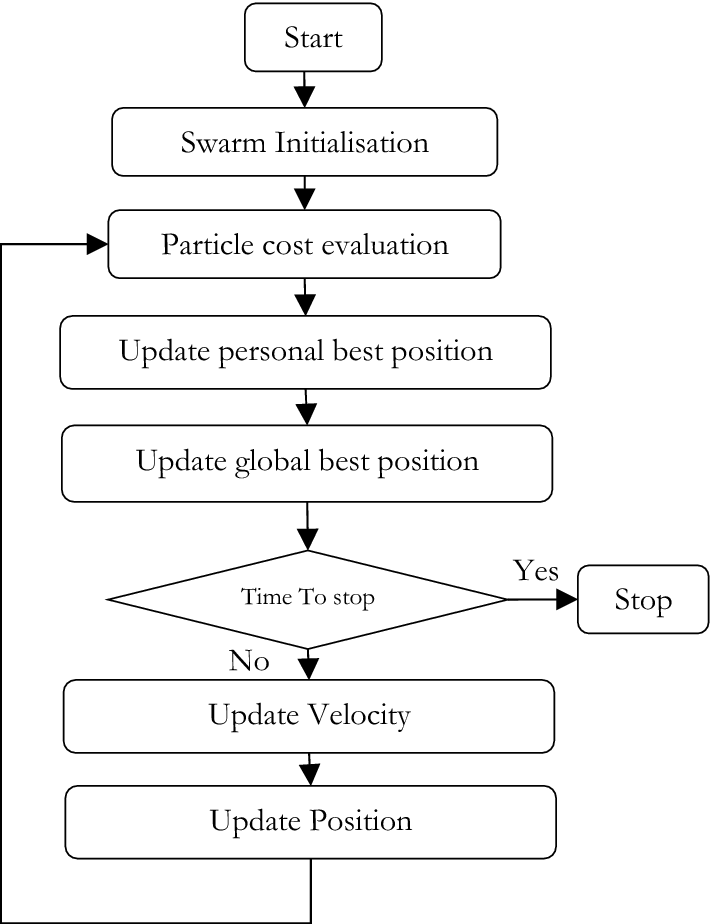

# Particle Swarm Optimization (PSO)

## Overview

Particle Swarm Optimization (PSO) is a computational method used for optimizing a wide variety of problems by simulating the social behavior of birds flocking or fish schooling. Introduced by James Kennedy and Russell Eberhart in 1995, PSO is a type of evolutionary algorithm and is used to find optimal solutions by iteratively improving a candidate solution with regard to a given measure of quality or fitness.

## Key Concepts

1. **Particles and Swarm**:
   - Each potential solution is called a "particle".
   - A group of particles is called a "swarm".
   - Particles move through the search space to find the best solution by updating their positions and velocities based on their own experience and the experience of neighboring particles.

2. **Position and Velocity**:
   - Each particle has a position vector representing a candidate solution.
   - Each particle has a velocity vector that determines its movement through the search space.
   - Particles update their positions and velocities iteratively to explore the search space.

3. **Personal Best and Global Best**:
   - Each particle keeps track of its own best position, known as the personal best (p_best).
   - The swarm keeps track of the overall best position found by any particle, known as the global best (g_best).

## Mechanism of Particle Swarm Optimization

The PSO algorithm involves the following steps:

1. **Initialization**:
   - Initialize a swarm of particles with random positions and velocities in the search space.
   - Evaluate the fitness of each particle's position.
   - Initialize (p_best) for each particle and (g_best) for the swarm.

2. **Iteration**:
   - For each particle, update its velocity based on:
     - Its current velocity.
     - The distance from its current position to its personal best position.
     - The distance from its current position to the global best position.
   - Update the particle's position based on its new velocity.
   - Evaluate the fitness of the new position.
   - Update (p_best) if the new position is better than the previous personal best.
   - Update (g_best) if the new position is better than the previous global best.

3. **Termination**:
   - Repeat the iteration steps until a stopping condition is met (e.g., a maximum number of iterations or a satisfactory solution quality is achieved).

## Update the Velocity



## Particle Swarm Optimization flowchart



## Pseudo-Code for Particle Swarm Optimization

```pseudo
Initialize swarm with random positions and velocities
For each particle, initialize p_best and evaluate fitness
Initialize g_best with the best fitness found in the swarm

While (stopping condition not met):
    For each particle:
        Update velocity:
            v_i = w * v_i + c1 * r1 * (p_best_i - x_i) + c2 * r2 * (g_best - x_i)
        Update position:
            x_i = x_i + v_i
        Evaluate fitness of new position
        If (fitness of new position > fitness of p_best):
            Update p_best with new position
        If (fitness of new position > fitness of g_best):
            Update g_best with new position

Return g_best
```

## Advantages

1. **Simple Concept and Implementation**:
   - PSO is easy to understand and implement, with straightforward mathematical operations and intuitive concepts.

2. **Few Parameters to Adjust**:
   - PSO has relatively few parameters to tune (e.g., inertia weight, cognitive and social coefficients), making it simpler to use compared to other optimization algorithms.

3. **Fast Convergence**:
   - PSO often converges faster to an optimal or near-optimal solution compared to other evolutionary algorithms like Genetic Algorithms (GA).

4. **Flexible and Robust**:
   - PSO is versatile and can be applied to a wide range of optimization problems, both continuous and discrete.

## Disadvantages

1. **Premature Convergence**:
   - PSO can sometimes converge prematurely to a local optimum, especially in complex, multimodal search spaces.

2. **Parameter Sensitivity**:
   - The performance of PSO can be sensitive to the choice of parameters, requiring careful tuning for different problems.

3. **Lack of Diversity**:
   - Without mechanisms to maintain diversity in the swarm, PSO can suffer from a lack of exploration in the search space, leading to suboptimal solutions.

## Applications

1. **Engineering Design**:
   - PSO is used to optimize the design of engineering systems and structures, such as aerodynamic shapes, electrical circuits, and mechanical components.

2. **Machine Learning**:
   - PSO is applied to optimize hyperparameters, select features, and train machine learning models, including neural networks and support vector machines.

3. **Scheduling**:
   - PSO optimizes scheduling problems in manufacturing, project management, and timetabling to improve efficiency and reduce costs.

4. **Robotics and Control**:
   - PSO is used in robotic path planning, control system design, and sensor fusion to enhance the performance and autonomy of robotic systems.

5. **Finance**:
   - PSO is applied to portfolio optimization, option pricing, and financial forecasting to maximize returns and minimize risks.

6. **Communications and Networks**:
   - PSO optimizes network design, routing, and resource allocation in communication systems to improve performance and reduce costs.

## Conclusion

Particle Swarm Optimization is a powerful and flexible optimization algorithm inspired by the social behavior of birds and fish. Its simplicity, fast convergence, and wide applicability make it a popular choice for solving various optimization problems. However, care must be taken to avoid premature convergence and ensure adequate parameter tuning to achieve the best results.