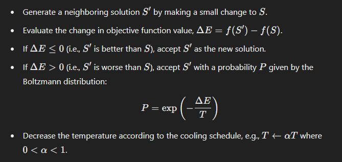
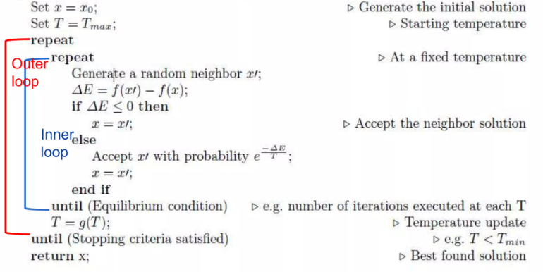
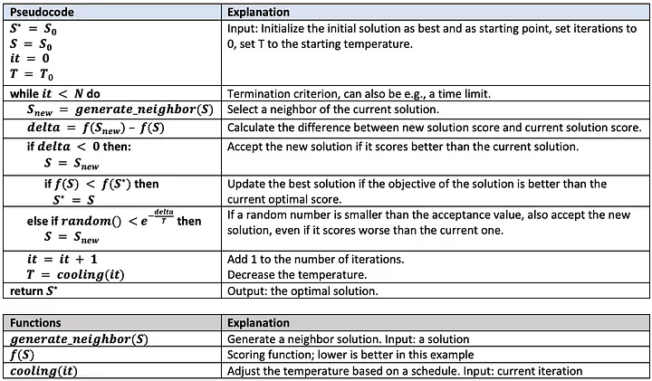
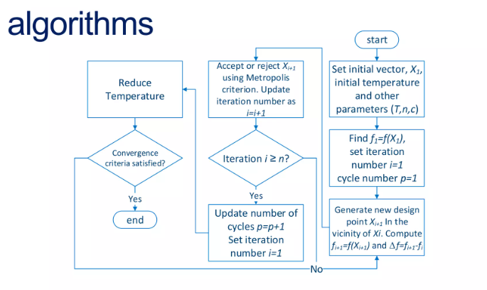
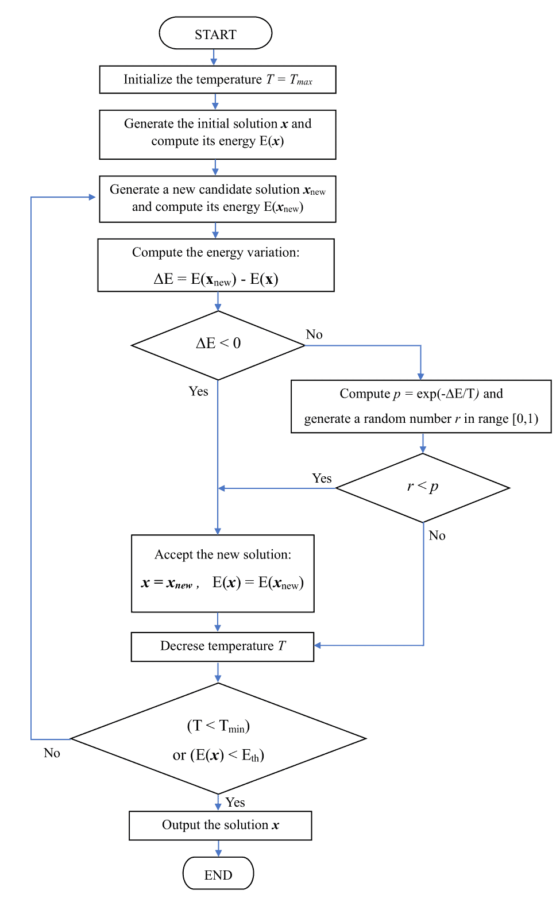

# Simulated Annealing (SA)

## Overview

Simulated Annealing (SA) is a probabilistic optimization algorithm inspired by the annealing process in metallurgy, where a material is heated and then slowly cooled to minimize defects, resulting in a more stable structure. SA is used to find an approximate global optimum of a given function, particularly useful for optimization problems with a large search space and many local optima.

## Key Concepts

1. **Annealing Process**:
   - **Heating**: The material is heated to a high temperature where atoms can move freely.
   - **Cooling**: The temperature is gradually decreased, allowing atoms to settle into a low-energy, stable state.

2. **Optimization Analogy**:
   - **Solution Space**: Represents all possible solutions to the optimization problem.
   - **Objective Function**: The function to be minimized or maximized.
   - **Temperature**: Controls the probability of accepting worse solutions to escape local optima.
   - **Cooling Schedule**: Gradually reduces the temperature to refine the search towards an optimal solution.

## Mechanism of Simulated Annealing

The SA algorithm involves the following steps:

1. **Initialization**:
   - Start with an initial solution \(S\) and an initial temperature \(T\).
   - Set parameters for the cooling schedule, such as the cooling rate.

2. **Iteration**:
   - While the stopping condition is not met (e.g., temperature below a threshold, maximum iterations reached):

    

3. **Termination**:
   - The algorithm terminates when the stopping condition is met, and the current solution is considered the approximate global optimum.

---

   

   

## Pseudo-Code for Simulated Annealing

```pseudo
Initialize initial solution S
Initialize temperature T
Set cooling rate α

While (stopping condition not met):
    Generate a new candidate solution S'
    Calculate the change in objective function ΔE = f(S') - f(S)
    
    If ΔE ≤ 0:
        Accept S' as the new solution
    Else:
        Accept S' with probability P = exp(-ΔE / T)
    
    Update temperature T = α * T

Return the best solution found
```

**The Algorithm**



##### Or this :



## Advantages

1. **Global Search Capability**:
   - **Escaping Local Optima**: One of the primary strengths of SA is its ability to escape local optima. By occasionally accepting worse solutions, the algorithm avoids getting stuck in suboptimal regions of the search space.
   - **Probabilistic Acceptance**: The probability of accepting worse solutions decreases over time, which allows the algorithm to explore the search space extensively in the beginning and focus more on exploitation as it progresses.

2. **Versatility**:
   - **Wide Applicability**: SA can be applied to a diverse range of optimization problems, including those that are discrete, continuous, or combinatorial in nature. This makes it a very flexible optimization tool.
   - **Adaptability**: The algorithm can be tailored to fit specific problem domains by adjusting the neighborhood generation method and the objective function evaluation.

3. **Simplicity**:
   - **Ease of Understanding**: The underlying principles of SA are easy to grasp. The analogy with the physical annealing process in metallurgy makes the concept intuitive.
   - **Simple Implementation**: The algorithm involves straightforward operations such as generating neighbors, calculating probabilities, and updating temperatures, which are easy to implement in most programming languages.

## Disadvantages

1. **Parameter Sensitivity**:
   - **Initial Temperature**: Choosing an appropriate initial temperature is crucial. If it is too high, the algorithm may spend too much time exploring, while if it is too low, it might not escape local optima effectively.
   - **Cooling Rate**: The rate at which the temperature decreases (cooling schedule) needs careful tuning. Too rapid cooling can lead to premature convergence, whereas too slow cooling can make the algorithm computationally expensive.

2. **Computational Cost**:
   - **Slow Convergence**: SA can be slow, especially for large and complex problems, because it requires many iterations to explore the search space and refine solutions.
   - **Iterative Nature**: The need to evaluate the objective function multiple times (for each generated neighbor) can be computationally intensive, particularly if the function itself is complex and time-consuming to evaluate.

3. **Problem-Specific Tuning**:
   - **Parameter Tuning**: Finding the right balance of parameters (initial temperature, cooling schedule, stopping criterion) for different problems can be challenging and often requires trial and error or expert knowledge.
   - **Neighborhood Generation**: The method of generating neighboring solutions must be suitable for the specific problem at hand, which may involve custom design and tuning.

## Applications

1. **Engineering Design**:
   - **Structural Optimization**: SA is used to optimize the design of structures such as bridges and buildings to achieve objectives like minimizing weight while ensuring strength and stability.
   - **Circuit Design**: In electronics, SA helps in optimizing the layout and design of circuits to improve performance and reduce costs.
   - **Mechanical Components**: Optimizing the design and material properties of mechanical components such as gears, bearings, and springs for better performance and longevity.

2. **Machine Learning**:
   - **Hyperparameter Tuning**: SA is used to optimize hyperparameters of machine learning models, improving their accuracy and efficiency.
   - **Feature Selection**: By selecting the most relevant features from large datasets, SA enhances the performance of machine learning models.
   - **Training Neural Networks**: SA can be applied to train neural networks by optimizing weights and biases to minimize the error function.

3. **Scheduling**:
   - **Job Scheduling**: In manufacturing, SA is used to optimize the scheduling of jobs on machines to minimize total production time and maximize resource utilization.
   - **Project Planning**: SA helps in creating optimal project schedules to meet deadlines and budget constraints.
   - **Timetabling**: In educational institutions, SA is applied to create optimal timetables for classes and exams, reducing conflicts and improving resource allocation.

4. **Operations Research**:
   - **Vehicle Routing**: SA optimizes the routes for vehicles in logistics and transportation to minimize travel time and costs.
   - **Facility Layout**: SA is used to design the layout of facilities (e.g., warehouses, factories) to improve efficiency and reduce operational costs.
   - **Inventory Management**: SA helps in optimizing inventory levels and reorder points to minimize holding costs and stockouts.

5. **Finance**:
   - **Portfolio Optimization**: SA is used to allocate assets in a portfolio to maximize returns and minimize risk, providing balanced investment strategies.
   - **Option Pricing**: SA helps in calibrating models for accurately pricing financial derivatives like options, ensuring better financial decision-making.
   - **Risk Management**: SA is applied to optimize risk management strategies, balancing risk and reward in various financial contexts.

## Conclusion

Simulated Annealing is a powerful and flexible optimization algorithm inspired by the physical process of annealing. Its ability to escape local optima and explore the search space effectively makes it suitable for a wide range of optimization problems. However, its performance is highly dependent on the choice of parameters and can be computationally intensive, requiring careful tuning and potentially significant computational resources. Despite these challenges, its simplicity and broad applicability make it a valuable tool in both theoretical and practical optimization contexts.