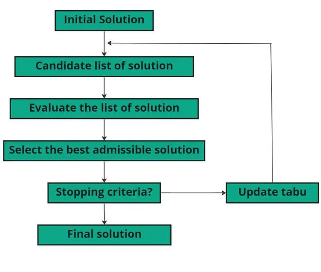

# Tabu Search (TS)

## Overview

Tabu Search (TS) is a metaheuristic optimization algorithm designed to find high-quality solutions to complex combinatorial problems. It was introduced by Fred Glover in the 1980s and is characterized by the use of memory structures to avoid cycling back to previously visited solutions, thereby enhancing the search process.

## Key Concepts

1. **Neighborhood Search**:
   - TS explores the search space by moving from the current solution to a neighboring solution. The neighborhood is defined by a set of solutions that can be reached by making small changes to the current solution.

2. **Tabu List**:
   - A short-term memory structure that keeps track of recently visited solutions or attributes of solutions. The tabu list prevents the algorithm from revisiting these solutions, which helps in avoiding local optima and cycling.

3. **Aspiration Criteria**:
   - Conditions under which a tabu move can be overridden if it leads to a solution better than any found so far. This ensures that the search process is flexible and can still explore promising regions of the search space.

4. **Long-Term Memory**:
   - Used to diversify the search by encouraging the exploration of unvisited regions of the search space. This memory can store information such as the frequency of certain solution attributes or patterns.

## Mechanism of Tabu Search

The TS algorithm can be summarized in the following steps:

1. **Initialization**:
   - Start with an initial solution S.
   - Initialize the tabu list and set parameters such as tabu tenure (the length of time a solution remains in the tabu list).

2. **Iteration**:
   - Generate a set of neighboring solutions of the current solution S.
   - Evaluate the quality (fitness) of each neighboring solution.
   - Select the best neighboring solution that is not in the tabu list or satisfies the aspiration criteria.
   - Update the current solution to this best neighboring solution.
   - Update the tabu list with attributes of the current solution, ensuring the tabu tenure is maintained.

3. **Termination**:
   - Repeat the iteration steps until a stopping condition is met (e.g., a maximum number of iterations or a satisfactory solution quality is achieved).

## Tabu Search Flowchart



## Pseudo-Code for Tabu Search

```pseudo
Initialize initial solution S
Initialize tabu list
Set tabu tenure and other parameters

While (stopping condition not met):
    Generate neighborhood solutions of S
    Evaluate fitness of each neighbor
    Select the best neighbor that is not tabu or satisfies aspiration criteria
    Update current solution to the selected neighbor
    Update tabu list with attributes of the current solution

Return the best solution found
```

## Advantages

1. **Avoidance of Local Optima**:
   - The use of a tabu list prevents the algorithm from revisiting previously explored solutions, helping it escape local optima and continue searching for better solutions.

2. **Flexible Memory Structures**:
   - TS employs both short-term and long-term memory structures, allowing it to balance intensification (exploring around the current solution) and diversification (exploring new regions).

3. **Versatility**:
   - TS is applicable to a wide range of optimization problems, including scheduling, routing, and resource allocation.

## Disadvantages

1. **Parameter Sensitivity**:
   - The performance of TS can be sensitive to the choice of parameters, such as the size of the tabu list and the tabu tenure. These parameters often require fine-tuning for different problems.

2. **Computational Cost**:
   - Evaluating the fitness of all neighboring solutions in each iteration can be computationally expensive, especially for large and complex problems.

3. **Complexity of Implementation**:
   - Implementing TS can be more complex than some other heuristics due to the need to manage memory structures and ensure the tabu criteria and aspiration conditions are correctly applied.

## Applications

1. **Scheduling**:
   - **Job Scheduling**: Optimizing the allocation of jobs to machines in a manufacturing process to minimize total production time.
   - **Timetabling**: Creating schedules for schools or universities to minimize conflicts and efficiently use resources.

2. **Routing**:
   - **Vehicle Routing**: Finding the optimal routes for a fleet of vehicles to deliver goods, minimizing travel time and costs.
   - **Network Design**: Optimizing the design of communication networks to improve performance and reduce costs.

3. **Resource Allocation**:
   - **Portfolio Optimization**: Allocating assets in a financial portfolio to maximize returns and minimize risk.
   - **Project Management**: Allocating resources to tasks in a project to minimize completion time and costs.

4. **Combinatorial Optimization**:
   - **Traveling Salesman Problem (TSP)**: Finding the shortest possible route that visits a set of cities and returns to the origin city.
   - **Knapsack Problem**: Selecting a subset of items with given weights and values to maximize the total value without exceeding the weight limit.

## Conclusion

Tabu Search is a powerful and flexible optimization algorithm that effectively navigates complex search spaces by utilizing memory structures to avoid revisiting solutions and promote exploration. While it requires careful parameter tuning and can be computationally intensive, its ability to escape local optima and find high-quality solutions makes it a valuable tool for solving a wide range of optimization problems.