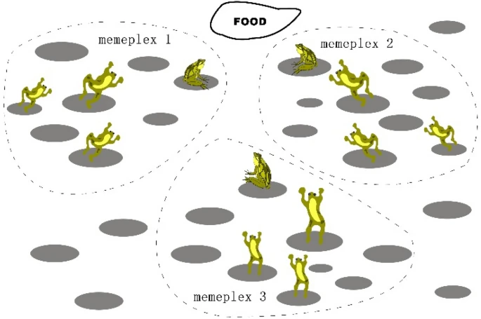
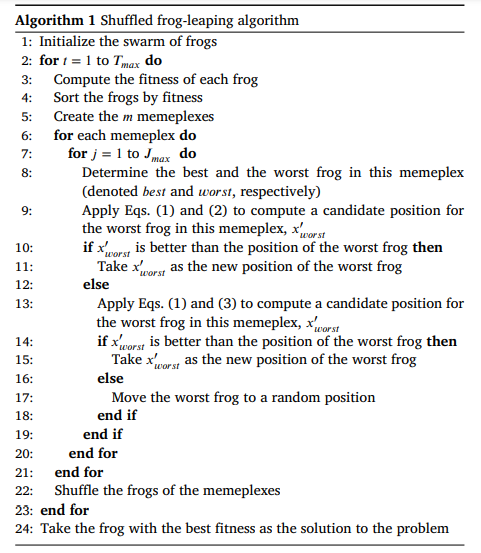
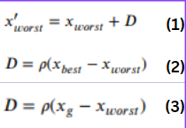
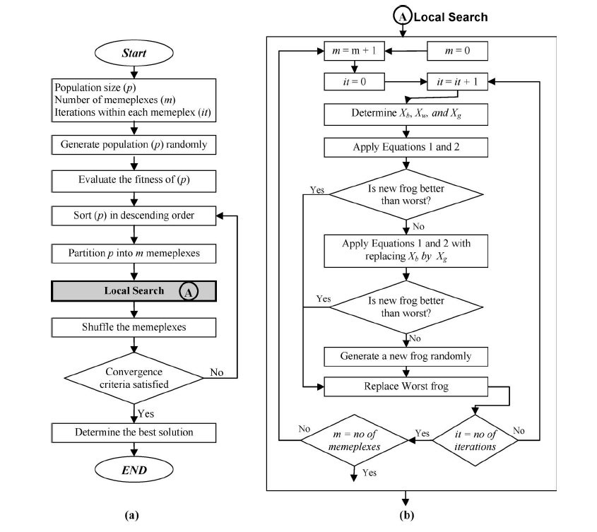

# The Shuffled Frog Leaping Algorithm (SFLA)

## Overview

The Shuffled Frog Leaping Algorithm (SFLA) is a metaheuristic optimization algorithm inspired by the natural behavior and social evolution of frogs when searching for food. It combines the benefits of the particle swarm optimization and the genetic algorithm by mimicking both local search and global information sharing among individuals. SFLA was developed by Muzaffar Eusuff and Kevin Lansey in 2003.



## Key Concepts

1. **Population and Memeplexes**:
   - The entire population of potential solutions (frogs) is divided into several subgroups called memeplexes.
   - Each memeplex represents a local search region, and frogs within a memeplex share information and evolve together.

2. **Local Search**:
   - Within each memeplex, frogs perform local searches by updating their positions based on the best and worst frogs in the memeplex.
   - This local search process helps in intensifying the search around promising regions.

3. **Shuffling and Global Search**:
   - After a certain number of local search iterations, frogs from all memeplexes are shuffled and re-divided into new memeplexes.
   - This shuffling process facilitates global information sharing and exploration of the search space.

## Mechanism of Shuffled Frog Leaping Algorithm

The SFLA involves the following steps:

1. **Initialization**:
   - Generate an initial population of frogs randomly positioned in the search space.
   - Sort the frogs based on their fitness values.
   - Divide the frogs into several memeplexes.

2. **Local Search within Memeplexes**:
   - For each memeplex:
     - Identify the best and worst frogs.
     - Update the position of the worst frog based on the best frog's position.
     - If the new position of the worst frog is better, update it; otherwise, generate a new random position for the worst frog.

3. **Shuffling**:
   - After a predefined number of iterations of local search, shuffle the frogs and re-divide them into new memeplexes.

4. **Termination**:
   - Repeat the local search and shuffling steps until a stopping condition is met (e.g., a maximum number of iterations or a satisfactory solution quality is achieved).

## Pseudo-Code for Shuffled Frog Leaping Algorithm

```pseudo
Initialize population of frogs
Sort frogs based on fitness
Divide frogs into memeplexes

While (stopping condition not met):
    For each memeplex:
        Identify best and worst frogs
        Update worst frog's position
        If no improvement, generate new random position for worst frog
    
    Shuffle and re-divide frogs into memeplexes

Return the best solution found
```

**Or**



**and the equations :**




## SFLA FlowChart 



## Advantages

1. **Effective Exploration and Exploitation**:
   - The combination of local search within memeplexes and global shuffling ensures a good balance between exploration of the search space and exploitation of promising regions.

2. **Robustness**:
   - SFLA is robust and can be applied to a variety of optimization problems, including both continuous and discrete problems.

3. **Simplicity and Flexibility**:
   - The algorithm is simple to understand and implement, and its components can be easily adapted to different problem domains.

## Disadvantages

1. **Parameter Sensitivity**:
   - The performance of SFLA can be sensitive to the choice of parameters, such as the number of memeplexes and the number of iterations for local search and shuffling.

2. **Computational Cost**:
   - Depending on the problem size and complexity, SFLA can be computationally expensive, particularly if many iterations are required to converge to an optimal solution.

## Applications

1. **Engineering Design**:
   - SFLA is used to optimize the design of engineering systems, such as structural design, electrical circuits, and mechanical components.

2. **Scheduling**:
   - **Job Scheduling**: SFLA optimizes the allocation of jobs to machines to minimize production time.
   - **Timetabling**: SFLA creates efficient schedules for schools or universities to minimize conflicts and maximize resource utilization.

3. **Routing**:
   - **Vehicle Routing**: SFLA optimizes the routes for a fleet of vehicles to minimize travel time and costs.
   - **Network Design**: SFLA improves the design of communication networks to enhance performance and reduce costs.

4. **Resource Allocation**:
   - **Portfolio Optimization**: SFLA allocates assets in a financial portfolio to maximize returns and minimize risks.
   - **Project Management**: SFLA optimizes the allocation of resources to tasks in a project to minimize completion time and costs.

5. **Combinatorial Optimization**:
   - **Traveling Salesman Problem (TSP)**: SFLA finds near-optimal tours by iteratively improving candidate tours through local search and global shuffling.
   - **Knapsack Problem**: SFLA optimizes the selection of items to maximize the total value without exceeding the weight limit.

## Conclusion

The Shuffled Frog Leaping Algorithm is a versatile and effective optimization algorithm that combines local and global search strategies to find high-quality solutions to complex problems. Its robustness, simplicity, and flexibility make it suitable for a wide range of applications, although careful tuning of parameters is essential for optimal performance. The iterative process of local search within memeplexes and global shuffling ensures a good balance between exploration and exploitation, making SFLA a powerful tool for solving optimization problems.
